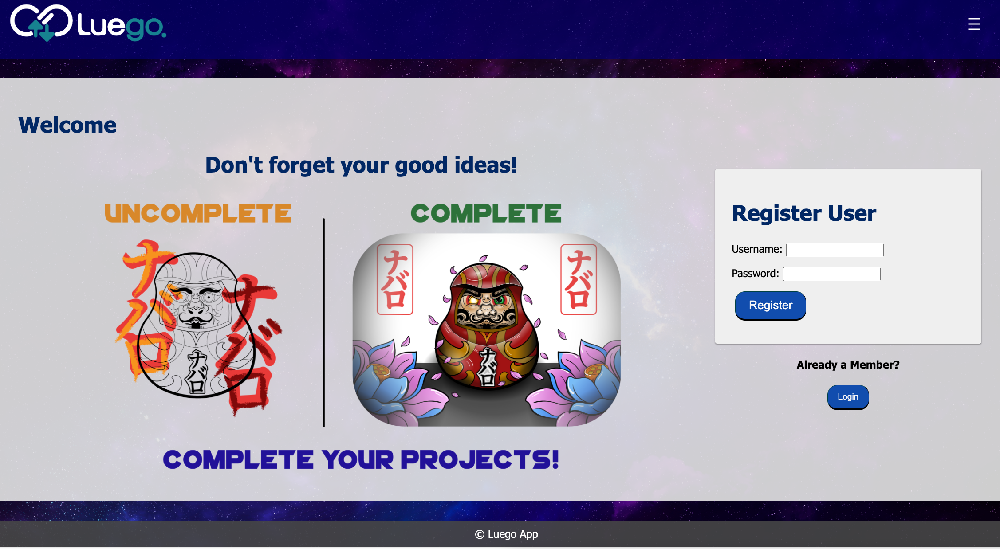
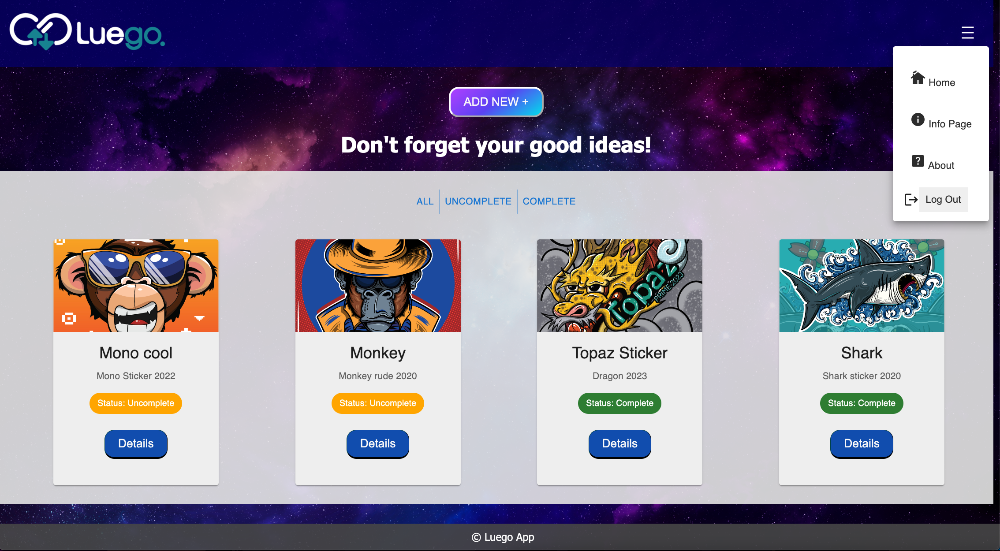
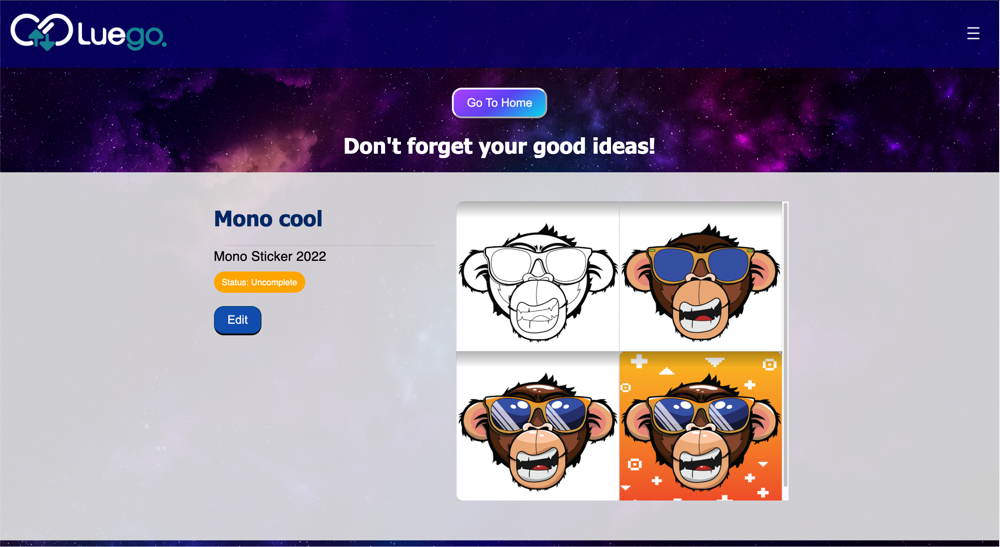
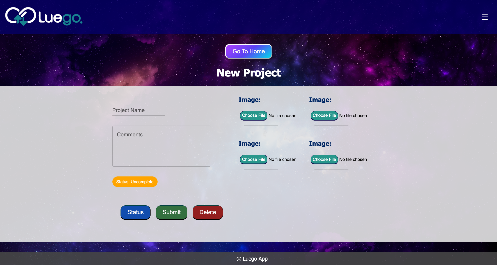

# Luego APP: Don’t forget your creative ideas! 

Luego is a personal app for creative minds who wants to keep track of their process and progress of creative projects; it is not a social media app. The objective of this application is to help log ongoing creative ideas in a single, organized space. Additionally, this will help keep track of the status of projects and final work.

This app is made to help people store, develop and complete their projects. 

[Live Deployed Site](https://obscure-falls-63223-89065279287d.herokuapp.com/)

## Screenshots

### Landing Page

### Home Page 

### Details Page

### Add New project Page

## Getting Started

These instructions will get you a copy of the project up and running on your local machine for development and testing purposes.

### Prerequisites

Before you get started, make sure you have the following software installed on your computer and have completed all tasks:

- [Node.js](https://nodejs.org/en/)
- [PostrgeSQL](https://www.postgresql.org/)
- [Nodemon](https://nodemon.io/)

### Installing

* First, make a fork or template of this repository and clone it down to your machine
* Run `npm install`
* Set up your databases using the statements in the database folder
* Start postgres if not running
* Run `npm run server`
* Run `npm run client`

## Built With

* [Node.js](https://nodejs.org/en/)
* [Express](https://expressjs.com/)
* [React](https://react.dev/)
* [Redux](https://redux.js.org/)
* [Material UI](https://mui.com/)
* [Postgres](https://www.postgresql.org/)
* [Amazon Web Services](https://aws.amazon.com/)
* [Passport]

## Author

* **Javier Navarro** - [Gibhub Profile](https://github.com/Javierna182)

## Acknowledgments

* Thank you to [Prime Digital Academy](https://www.primeacademy.io/) whose starter repo used!
* Thank you to our instructors, Zac Delventhal, Chris Black, and Peter DeMaio

